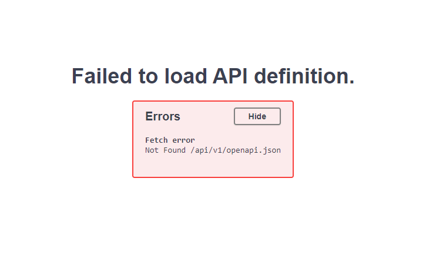

## Common Fixes

...

### Fix: "Failed to load API Definition. Not found /api/v1/openapi.json"

When running behind a proxy (and in some other circumstances) you will get an error when trying to load the `/docs` endpoint. The error will say "Failed to load API definition. Fetch error Not Found /api/v1/openapi.json":



To fix this, simply modify your `app = FastAPI()` line, adding `openapi_url="/docs/openapi":

```py title="fastapi main.py" linenums="1"

...

# app = FastAPI(openapi_url="/docs/openapi")
app = FastAPI(openapi_url="/docs/openapi")
```
