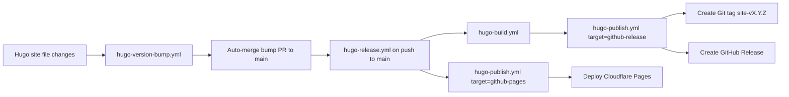
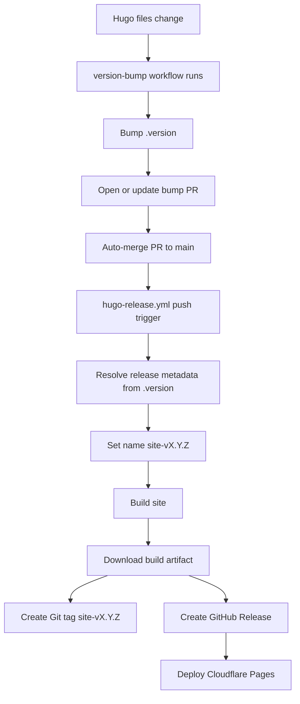
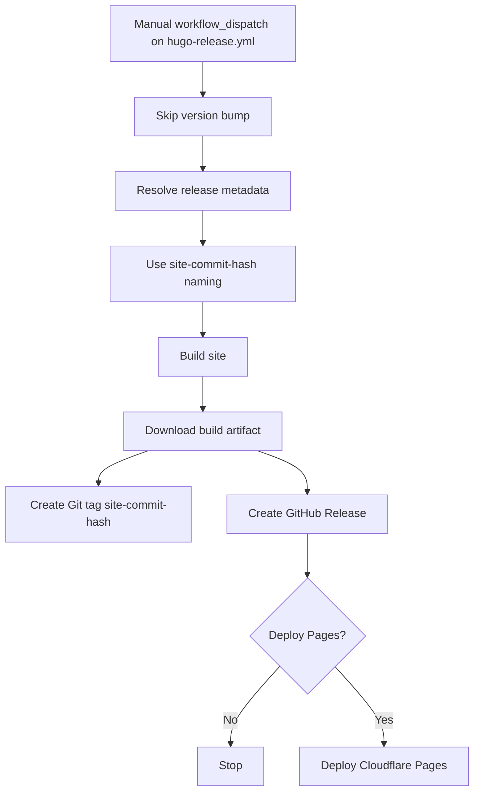

# RedKB - Release Documentation <!-- omit in toc -->

The repository uses a [workflow defined in my PipelineTemplates repository](https://github.com/redjax/PipelineTemplates/blob/main/.github/workflows/hugo-publish.yml) to build and publish the Hugo site. The pipelines in this repository are meant to be "stubs" that call functionality centralized in the PipelineTemplates repository.

## Table of Contents <!-- omit in toc -->

- [Overview](#overview)
- [Diagrams](#diagrams)
  - [General pipeline flow](#general-pipeline-flow)
  - [Hugo site file change path](#hugo-site-file-change-path)
  - [Manual build path](#manual-build-path)
- [Using the Github CLI to trigger releases](#using-the-github-cli-to-trigger-releases)
  - [Authenticating with Github CLI](#authenticating-with-github-cli)
- [Test trigger with empty commit](#test-trigger-with-empty-commit)

## Overview

When a pull request is merged into the `main` branch, the [`hugo-version-bump.yml` pipeline](../.github/workflows/hugo-version-bump.yml) will trigger if any files related to the Hugo site have changed. The detect rules are listed at the top of the pipeline and may change over time, but generally the patterns it searches for are:

- `archetypes/**`
- `content/**`
- `data/**`
- `i18n/**`
- `static/**`
- `hugo.yml`
- `go.mod`
- `go.sum`

If it detects changes, it bumps the [`.version` file](../.version) at the repository root, opens a pull request to the `main` branch with the bumped version, and automatically merges it.

Merges to `main` where `.version` (or `.bumpversion.toml`) have changed trigger the [`hugo-tag.yml` pipeline](../.github/workflows/hugo-tag.yml), which creates a [tag in the repository](https://github.com/redjax/redkb/tags) for the new version.

When a new tag is created, the [`hugo-build.yml` pipeline](../.github/workflows/hugo-build.yml) triggers, building the site with Hugo and uploading them as artifacts to the pipeline When the build finishes, it triggers the [`hugo-release.yml` pipeline](../.github/workflows/hugo-release.yml).

The release pipeline checks inputs to see which releases to do (Github Pages, Cloudflare Pages (not used currently), or a Github release). If the pipeline determines a release should occur, it calls the [`hugo-publish.yml` pipeline](../.github/workflows/hugo-publish.yml). By default the pipeline will create a Github release and publish to Github Pages.

The first thing to publish is a [Github release](https://github.com/redjax/redkb/releases). This will upload any archives created by the build pipeline to a release matching the current version, i.e. `site-v1.2.3`, or if the pipeline was triggered manually, a release that has the current commit hash appended, i.e. `site-b6fdbad`.

Finally, the pipeline will download the latest release asset and deploy it to Github Pages.

## Diagrams

### General pipeline flow



### Hugo site file change path

Runs on any change to a Hugo site file, i.e.:

- `archetypes/**`
- `content/**`
- `data/**`
- `i18n/**`
- `static/**`
- `hugo.yml`
- `go.mod`
- `go.sum`



### Manual build path



## Using the Github CLI to trigger releases

When developing a pipeline, you may need to trigger it in a way the Github webUI doesn't allow. For example, if you create a brand new pipeline, or if you add a `workflow_dispatch` and have not merged the branch with this change yet.

You can use the [Github CLI](https://cli.github.com) to trigger a pipeline from a specific branch, in ways that the Github webUI doesn't allow. For example, if the [`hugo-release.yml` pipeline](../.github/workflows/hugo-release.yml) did not have a `workflow_dispatch` on the `main` branch, but you added one in a branch named `feat/manual-trigger-release`, you can test that trigger before merging the changes into `main`. If you went to this pipeline in the webUI, you would see there is no manual trigger button. This is because the `workflow_dispatch` change does not exist on the `main` branch.

You can trigger the pipeline manually with the `gh` CLI like:

```shell
gh workflow run hugo-release.yml --ref feat/manual-trigger-release
```

If a `workflow_dispatch` has inputs, you can pass them with `-f`, like:

```shell
gh workflow run pipeline-filename.yml \
  --ref feat/manual-trigger-release \
  -f input-one=false \
  -f input-two=some-value
```

### Authenticating with Github CLI

If you try to run a pipeline manually using the `gh` CLI, but you are not signed in or do not have admin privileges, you will see an error like:

```shell
could not create workflow dispatch event: HTTP 403: Must have admin rights to Repository.
```

To fix this, use a [Personal Access Token (PAT)](https://docs.github.com/en/authentication/keeping-your-account-and-data-secure/managing-your-personal-access-tokens) with the following permissions:

- Actions: Read and write
- Contents: Read and write
- Workflows: Read and write

You can also optionally add the below to enable more functionality via the `gh` CLI:

- Code scanning alerts: Read only
- Deployments: Read and write (to manage Github Pages deployments)
- Issues: Read and write (to manage issues from the CLI)
- Pages: Read and write (for managing Pages deployments)
- Pull requests: Read and write (to manage PRs from the CLI)

Then, run `gh auth login` to start the interactive login process. If you are not able to do the interactive method, export your token with:

```shell
export GH_TOKEN="<your-gh-PAT>"
```

Then, run your `gh` commands; they will use the `$GH_TOKEN` environment variable automatically. For example:

```shell
gh workflow run Some\ pipeline\ name --ref feat/branch-to-run-on
```

## Test trigger with empty commit

For fully automatic pipelines, i.e. ones that run on PR open or merge, you can trigger the behavior by adding a `push` to your branch, then pushing an empty commit.

For example, in the [`hugo-release.yml` pipeline](../.github/workflows/hugo-release.yml), the pipeline watches for changes to `.version` and `.bumpversion.toml` on pull requests that are merged to the `main` branch:

```yaml
---
name: Hugo release

on:
  push:
    branches:
      - main
    paths:
      - ".version"
      - ".bumpversion.toml"
```

To test this automatic trigger from your branch, you can add the current branch name, i.e. `feat/something-automatic`, disable path filtering, and push an empty commit:

```shell
---
name: Hugo release

on:
  push:
    branches:
      - main
      ## Watch the current branch, in addition to main.
      #  Remove this when you're done testing, before
      #  merging back into main
      - feat/something-automatic

    ## Temporarily disable path watching
    # paths:
    #   - ".version"
    #   - ".bumpversion.toml"
```

Commit these changes, push them, then create and push an empty commit to trigger it:

```yaml
git commit --allow-empty -m "chore: test workflow trigger"
git push
```

> [!IMPORTANT]
> Don't forget to put your triggers back to normal after a successful test. Remove the branch and uncomment any filtering rules that should run on `main`.
