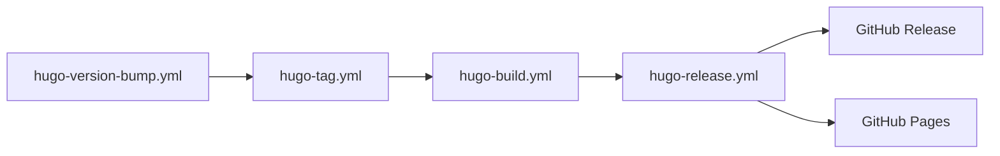
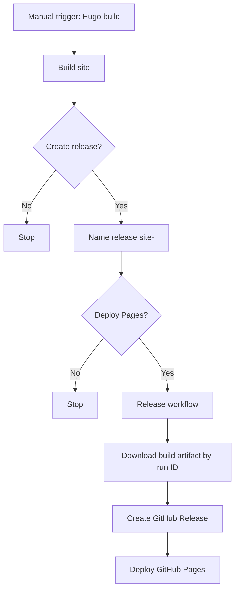
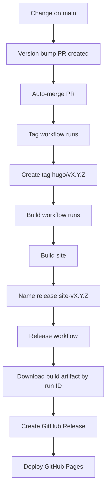
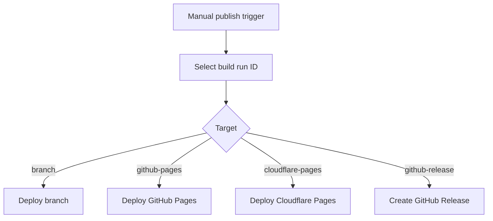

# RedKB - Release Documentation

## Merge Pipelines

```mermaid
flowchart LR
  A[hugo-version-bump.yml] --> B[hugo-tag.yml]
  B --> C[hugo-build.yml]
  C --> D[hugo-release.yml]
  D --> E[GitHub Release]
  D --> F[GitHub Pages]
```

### Manual Trigger

```mermaid
flowchart TD
  A[Manual trigger: Hugo build] --> B[Build site]
  B --> C{Create release?}
  C -- No --> D[Stop]
  C -- Yes --> E[Name release site-<commit-hash>]
  E --> F{Deploy Pages?}
  F -- No --> G[Stop]
  F -- Yes --> H[Release workflow]
  H --> I[Download build artifact by run ID]
  I --> J[Create GitHub Release]
  J --> K[Deploy GitHub Pages]
```

### Merge to main Trigger

```mermaid
flowchart TD
  A[Change on main] --> B[Version bump PR created]
  B --> C[Auto-merge PR]
  C --> D[Tag workflow runs]
  D --> E[Create tag hugo/vX.Y.Z]
  E --> F[Build workflow runs]
  F --> G[Build site]
  G --> H[Name release site-vX.Y.Z]
  H --> I[Release workflow]
  I --> J[Download build artifact by run ID]
  J --> K[Create GitHub Release]
  K --> L[Deploy GitHub Pages]
```

### Publish Only

```mermaid
flowchart TD
  A[Manual publish trigger] --> B[Select build run ID]
  B --> C{Target}
  C -- branch --> D[Deploy branch]
  C -- github-pages --> E[Deploy GitHub Pages]
  C -- cloudflare-pages --> F[Deploy Cloudflare Pages]
  C -- github-release --> G[Create GitHub Release]
```
