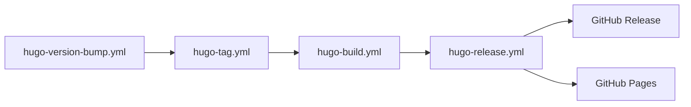
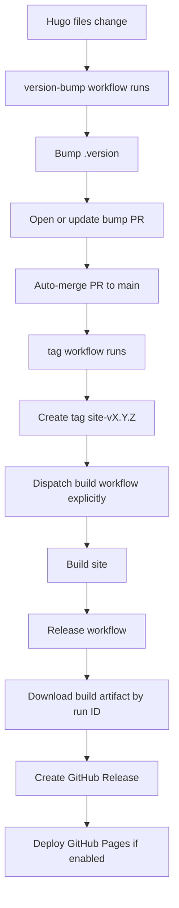
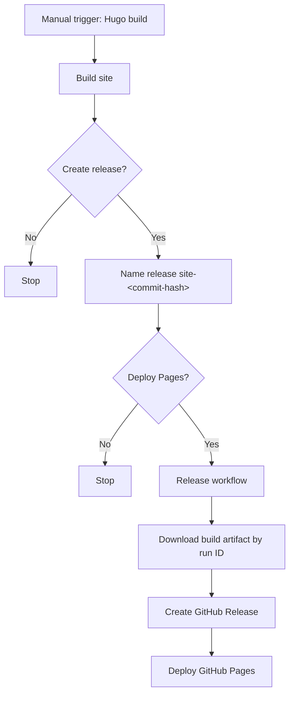
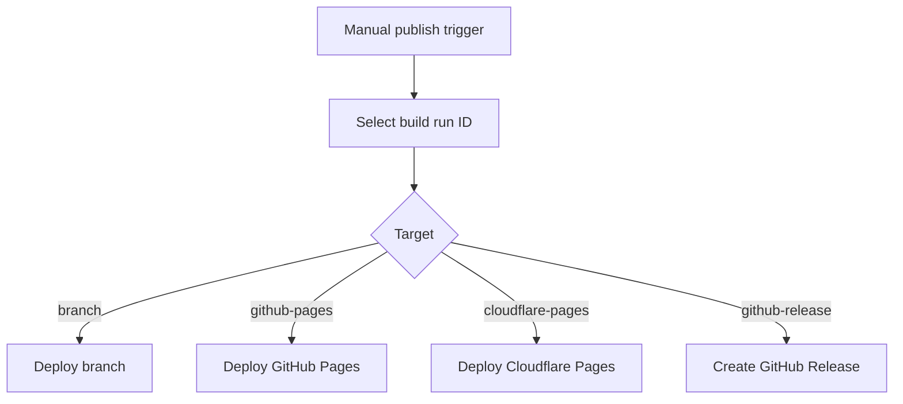

# RedKB - Release Documentation <!-- omit in toc -->

The repository uses a [workflow defined in my PipelineTemplates repository](https://github.com/redjax/PipelineTemplates/blob/main/.github/workflows/hugo-publish.yml) to build and publish the Hugo site. The pipelines in this repository are meant to be "stubs" that call functionality centralized in the PipelineTemplates repository.

## Table of Contents <!-- omit in toc -->

- [Overview](#overview)
- [Diagrams](#diagrams)
  - [General pipeline flow](#general-pipeline-flow)
  - [Hugo site file change path](#hugo-site-file-change-path)
  - [Manual build path](#manual-build-path)
  - [Publish only path](#publish-only-path)

## Overview

When a pull request is merged into the `main` branch, the [`hugo-version-bump.yml` pipeline](../.github/workflows/hugo-version-bump.yml) will trigger if any files related to the Hugo site have changed. The detect rules are listed at the top of the pipeline and may change over time, but generally the patterns it searches for are:

- `archetypes/**`
- `content/**`
- `data/**`
- `i18n/**`
- `static/**`
- `hugo.yml`
- `go.mod`
- `go.sum`

If it detects changes, it bumps the [`.version` file](../.version) at the repository root, opens a pull request to the `main` branch with the bumped version, and automatically merges it.

Merges to `main` where `.version` (or `.bumpversion.toml`) have changed trigger the [`hugo-tag.yml` pipeline](../.github/workflows/hugo-tag.yml), which creates a [tag in the repository](https://github.com/redjax/redkb/tags) for the new version.

When a new tag is created, the [`hugo-build.yml` pipeline](../.github/workflows/hugo-build.yml) triggers, building the site with Hugo and uploading them as artifacts to the pipeline When the build finishes, it triggers the [`hugo-release.yml` pipeline](../.github/workflows/hugo-release.yml).

The release pipeline checks inputs to see which releases to do (Github Pages, Cloudflare Pages (not used currently), or a Github release). If the pipeline determines a release should occur, it calls the [`hugo-publish.yml` pipeline](../.github/workflows/hugo-publish.yml). By default the pipeline will create a Github release and publish to Github Pages.

The first thing to publish is a [Github release](https://github.com/redjax/redkb/releases). This will upload any archives created by the build pipeline to a release matching the current version, i.e. `site-v1.2.3`, or if the pipeline was triggered manually, a release that has the current commit hash appended, i.e. `site-b6fdbad`.

Finally, the pipeline will download the latest release asset and deploy it to Github Pages.

## Diagrams

### General pipeline flow

### Hugo site file change path

Runs on any change to a Hugo site file, i.e.:

- `archetypes/**`
- `content/**`
- `data/**`
- `i18n/**`
- `static/**`
- `hugo.yml`
- `go.mod`
- `go.sum`

### Manual build path

### Publish only path

