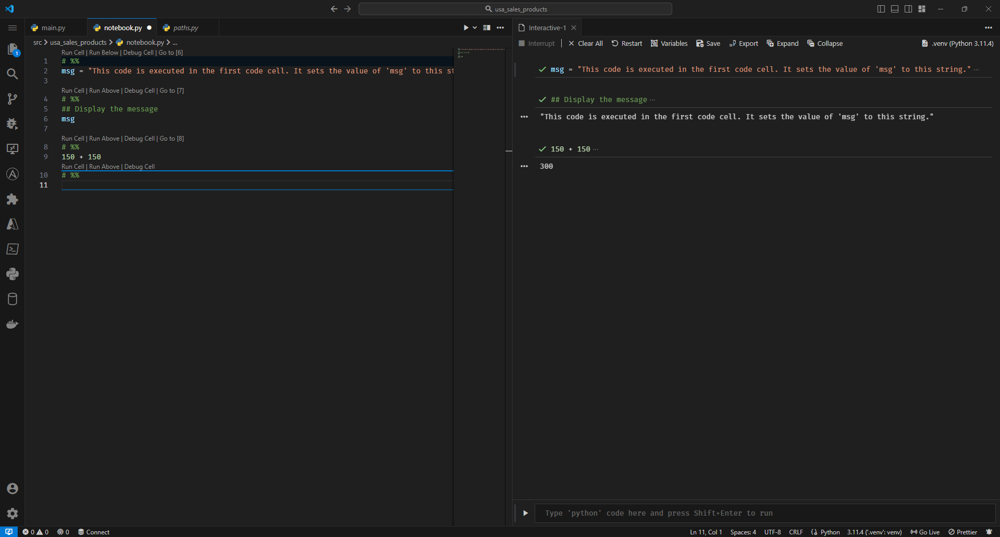

---
tags:
    - vscode
    - ide
    - python
    - jupyter
    - snippet
---

# Ad-Hoc, Jupyter-like code "cells"

!!! note

    * Your environment must have the `ipykernel` package installed.
    * I have only tested this with VSCode. It should work in any IDE that supports `ipykernel` (i.e. JetBrains), from what I've read, but I have not tested it anywhere else.

You can create ad-hoc "cells" in any `.py` file (i.e. `notebook.py`, `nb.py`, etc) by adding `# %%` line(s) to the file.

```python title="Example 'notebook.py' file" linenums="1"
# %%

```

You can also create multiple code cells by adding more `# %%` lines:

```python title="notebook.py" linenums="1"
# %%
msg = "This code is executed in the first code cell. It sets the value of 'msg' to this string."

# %%
## Display the message
msg

# %%
150 + 150
```

<figure markdown="span">
  
  <figcaption>Notebook cells in VSCode</figcaption>
</figure>
