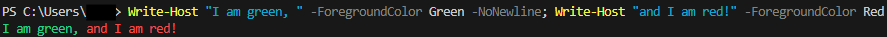
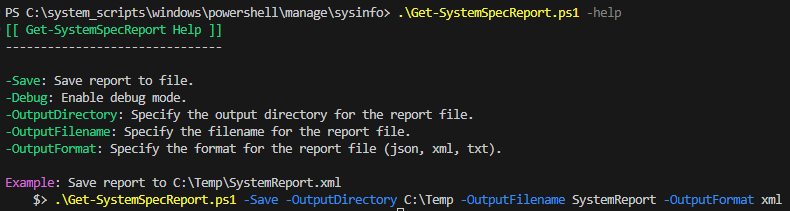

---
tags:
    - windows
    - powershell
    - snippets
---

# Snippets

Code snippets with little-to-no explanation.

## Winget

### Import/Export Winget packages

Export a list of installed packages discovered by winget to a `.json` file, then import the list to reinstall everything. Useful as a backup, or to move to a new computer.

!!! note

    The filename in the examples below, `C:\path\to\winget-pkgs.json`, can be named anything you want, as long as it has a `.json` file extension.

#### Export

```powershell title="winget export" linenums="1"
## Set a path, the file must be a .json
$ExportfilePath = "C:\path\to\winget-pkgs.json"

## Export package list
winget export -o "$($ExportfilePath)"
```

#### Import

```powershell title="winget import" linenums="1"
## Set the path to your export .json file
$ImportfilePath = "C:\path\to\winget-pkgs.json"

## Import package list
winget import -i "$($ImportfilePath)"
```

## Get uptime

```powershell title="Get machine uptime" linenums="1"
(Get-Date) – (Get-CimInstance Win32_OperatingSystem).LastBootUpTime
```

## Functions

Functions in your profile will be executed automatically if you call them within the profile, but they are also available to your entire session. For example, the [`Edit-Profile` function](#open-powershell-profileps1-file-for-editing) function can be executed in any session that loads a profile with that function declared!

### Check elevated/admin

The function below returns `$True` if the current Powershell session is elevated, otherwise returns `$False`.

```powershell title="Check elevated session" linenums="1"
function Get-ElevatedShellStatus {
    ## Check if current user is admin
    $Identity = [Security.Principal.WindowsIdentity]::GetCurrent()
    $Principal = New-Object Security.Principal.WindowsPrincipal $Identity
    $AdminUser = $Principal.IsInRole([Security.Principal.WindowsBuiltInRole]::Administrator)

    return $AdminUser
}

## Declare variable for references throughout script.
#  Can be used to prevent script from exiting/crashing.
$isAdmin = $(Get-ElevatedShellStatus)
```

### Open/execute as admin

```powershell title="Open as admin" linenums="1"
function Open-AsAdmin {
    <#
        Run command as admin, or start new admin session if no args are passed
    #>
    if ($args.Count -gt 0) {   
        $argList = "& '" + $args + "'"
        Start-Process "$psHome\powershell.exe" -Verb runAs -ArgumentList $argList
    }
    else {
        Start-Process "$psHome\powershell.exe" -Verb runAs
    }
}
```

### Open Powershell profile.ps1 file for editing

```powershell title="Edit profile" linenums="1"
function Edit-Profile {
    <#
        Open current profile.ps1 in PowerShell ISE
    #>
    If ($host.Name -match "ise") {
        ## Edit in PowerShell ISE, if available
        $psISE.CurrentPowerShellTab.Files.Add($profile.CurrentUserAllHosts)
    }
    Else {
        ## Edit in Notepad if no PowerShell ISE found
        notepad $profile.CurrentUserAllHosts
    }
}
```

### Delay Conda execution

[Conda](https://docs.conda.io/en/latest/) is a Python package manager. It's a very useful utility, but I've found adding it to my `$PATH` or Powershell profile results in a very slow session load in new tabs/windows. Adding the `SOURCE_CONDA` function below, and settings an alias to the `conda` command to call this function instead (`Set-Alias conda SOURCE_CONDA`), delays the sourcing of the `Conda` path. The first time you run `conda` in a new session, you will see a message that Conda has been initialized and you need to re-run your command. You can simply press the up key on your keyboard and run it again; now that Conda is initialized, it will execute, and once a Powershell session is loaded, sourcing Conda is much quicker!

```powershell title="Delay Conda sourcing" linenums="1"
function SOURCE_CONDA {
    <#
      Initialize Conda only when the conda command is run.
      Conda takes a while to initialize, and is not needed in
      every PowerShell session
    #>
    param(
      [String]$CONDA_ROOT = "%USERPROFILE%\mambaforge\Scripts\conda.exe"
    )
  
    #region conda initialize
    # !! Contents within this block are managed by 'conda init' !!
  (& "$CONDA_ROOT" "shell.powershell" "hook") | Out-String | Invoke-Expression
    #endregion

    Write-Host "Conda initialized. Run your command again."

}
```

### Get system uptime

Unix OSes have a very nice, simple command, `uptime`, that will simply print the number of days/hours/minutes your machine has been online. The Powershell syntax for this is difficult for me to remember, so my Powershell profile has an `uptime` function declared.

```powershell title="Get machine uptime" linenums="1"
function uptime {
    ## Print system uptime

    If ($PSVersionTable.PSVersion.Major -eq 5 ) {
        Get-WmiObject win32_operatingsystem |
        Select-Object @{EXPRESSION = { $_.ConverttoDateTime($_.lastbootuptime) } } | Format-Table -HideTableHeaders
    }
    Else {
        net statistics workstation | Select-String "since" | foreach-object { $_.ToString().Replace('Statistics since ', '') }
    }
}
```

### Unzip function

Unix OSes have a simple, easy to remember `unzip` command. This function tries to emulate that simplicity.

```powershell title="Unzip a file" linenums="1"
function unzip ($file) {
    ## Extract zip archive to current directory

    Write-Output("Extracting", $file, "to", $pwd)
    $fullFile = Get-ChildItem -Path $pwd -Filter .\cove.zip | ForEach-Object { $_.FullName }
    Expand-Archive -Path $fullFile -DestinationPath $pwd
}
```

### Touch a file (create empty file, if one doesn't exist)

Unix OSes have a useful utility called `touch`, which will create an empty file if one doesn't exist at the path you pass it, i.. `touch ./example.txt`. This function tries to emulate that usefulness and simplicity.

```powershell title="Powershell 'touch' equivalent" linenums="1"
function touch($file) {
    ## Create a blank file at $file path
    
    "" | Out-File $file -Encoding ASCII
}
```

### Lock your machine

Adding this function to your Powershell profile lets you lock your computer's screen by simply running `lock-screen` in a Powershell session.

```powershell title="Machine lock" linenums="1"
function lock-machine {
    ## Set computer state to Locked

    try {
        rundll32.exe user32.dll, LockWorkStation
    }
    catch {
        Write-Error "Unhandled exception locking machine. Details: $($_.Exception.Message)"
    }

}
```

## Formatting

### Inline formatting with -NoNewline

To format different parts of a `Write-Host` string without adding new lines, you can use the `-NoNewline;` param.

A simple example of making the left part of a string green and the right part red:

```powershell title="-NoNewline example" linenums="1"
Write-Host "I am green, " -ForegroundColor Green -NoNewline; Write-Host "and I am red!" -ForegroundColor Red
```

Which outputs:



You can format long strings with `-NoNewline;` by entering a new line after the `;` character.

```powershell title="Powershell help menu with -NoNewline;" linenums="1"
Param(
	[switch]$Help
)

If ( $Help ) {
    Write-Host "[[ Get-SystemSpecReport Help ]]" -ForegroundColor Green
    Write-Host ("-" * 31)
    Write-Host ""
    
    Write-Host "-Save" -ForegroundColor Green -NoNewline; Write-Host ": Save report to file."
    Write-Host "-Debug" -ForegroundColor Green -NoNewline; Write-Host ": Enable debug mode."
    Write-Host "-OutputDirectory" -ForegroundColor Green -NoNewline; Write-Host ": Specify the output directory for the report file."
    Write-Host "-OutputFilename" -ForegroundColor Green -NoNewline; Write-Host ": Specify the filename for the report file."
    Write-Host "-OutputFormat" -ForegroundColor Green -NoNewline; Write-Host ": Specify the format for the report file (json, xml, txt)."
    Write-Host ""

    ## Format shell code example using -NoNewline;
    Write-Host "Example" -ForegroundColor Magenta -NoNewline; Write-Host ": Save report to C:\Temp\SystemReport.xml"
    Write-Host "    $> " -NoNewline;
    Write-Host ".\Get-SystemSpecReport.ps1 " -ForegroundColor Yellow -NoNewline;
    Write-Host "-Save " -ForegroundColor Blue -NoNewline;
    Write-Host "-OutputDirectory " -ForegroundColor Blue -NoNewline;
    Write-Host "C:\Temp " -NoNewline;
    Write-Host "-OutputFilename " -ForegroundColor Blue -NoNewline;
    Write-Host "SystemReport " -NoNewline;
    Write-Host "-OutputFormat " -ForegroundColor Blue -NoNewline; 
    Write-Host  "xml"

    exit 0
}

```

The script content above outputs:


