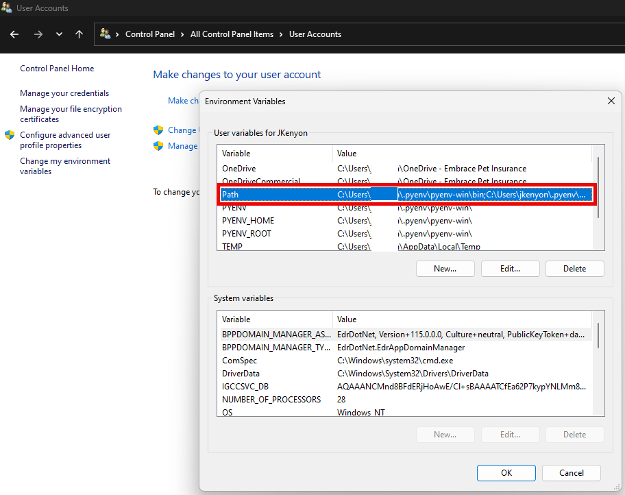

# Use pyenv for easier Python version management

!!! ToC

    Jump right to a section:

    - [Install pyenv](#install-pyenv)
      - [Windows instructions](#install-pyenv-in-windows)
      - [Linux/WSL instructions](#install-pyenv-in-linuxwsl)
    - [Using pyenv](#using-pyenv)

## TL;DR

If you're just here for a quick reference, use the sections below for quick `pyenv` setup & usage instructions. Any sections linked here will have a button that returns you to this `TL;DR` section, so if you're curious about one of the steps and follow a link you can get right back to it when you're done reading.

This is what the button will look like: ⤴️ [*back to `TL;DR`*](#tldr)

### TLDR 1: Install pyenv

See the [Install pyenv](#install-pyenv) section for OS-specific installation instructions.

!!! warning

    If you skip the installation instructions, make sure you add `pyenv` to your `PATH`. If you need help setting `PATH` variables, please read the [Install pyenv](#install-pyenv) section.

    - Linux:
        - Edit `~/.bashrc`, add this to the bottom of the file (if in a terminal environment, use an editor like `$ nano ~.bashrc`):

    ```shell title="Add pyenv to PATH" linenums="1"

    export PATH="$HOME/.pyenv/bin:$PATH"
    eval "$(pyenv init --path)"
    eval "$(pyenv virtualenv-init -)"

    ```

    - Windows:
      - Edit the user's `PATH` variable, add these 2 paths:
    
    ```cmd title="Add pyenv to the Windows path" linenums="1"

    
    %USERPROFILE%\\.pyenv\\pyenv-win\\bin
    %USERPROFILE%\\.pyenv\\pyenv-win\\shims
    ```

### TLDR 2: Choose from available Python versions

Show versions available for install. Update the list with `$ pyenv update` if you don't see the version you want.

```shell title="list & install python versions" linenums="1"

$ pyenv install -l
# 3.xx.x
# 3.xx.x-xxx
# ...

$ pyenv install 3.12.1
```

### TLDR 3: Set your global, local, & shell Python versions

!!! warning

    The `3.12.1` version string is used as an example throughout the documentation. Make sure you're using a more recent version, if one is available.

    You can check by running `$ pyenv update && pyenv install -l`.

**Examples commands**

- Set `global` version to `3.12.1`: `$ pyenv global 3.12.1`
- Set `global` to multiple versions, `3.12.1` + `3.11.8`: `$ pyenv global 3.12.1 3.11.8`
    - !!!Version-order
        The order of the versions you specify **does matter**. For example, in the command above, `3.12.1` is the "primary" Python, but `3.11.8` will also be available for tools like `pytest`, which can run tests against multiple versions of Python, provided they are available in the `PATH`.
- Set `local` version to `3.11.8`, creating a `.python-version` file in the process: `$ pyenv local 3.11.8`
    - Setting a `local` version will override the `global` setting
- Set `local` to multiple versions, `3.12.1` + `3.11.8`: `$ pyenv local 3.12.1 3.11.8`
- Set `shell` version to `3.

---

## What is pyenv

[`pyenv`](https://github.com/pyenv/pyenv) is a tool for managing versions of Python. It handles downloading the version archive, extracting & installing, and can isolate different versions of Python into their own individual environments.

`pyenv` can also handle running multiple versions of Python at the same time. For example, when using `nox`, you can declare a list of Python versions the session should run on, like `@nox.session(python=["3.11.2", "3.11.4", "3.12.1"], name="session-name")`. As long as one of the `pyenv` scopes (`shell`, `local`, or `global`) has all of these versions of Python, `nox` will run the session multiple times, once for each version declared in `python=[]`.

!!! note

    For more information on the problem `pyenv` solves, read the ["Why use pyenv?"](#why-use-pyenv) section below.
    
    If you just want to see installation & setup instructions, you can skip to the ["install pyenv"](#install-pyenv) section, or to ["using pyenv"](#using-pyenv) to see notes on using the tool.

    For more detailed (and likely more up-to-date) documentation on `pyenv` installation & usage, check the [`pyenv gihub's README`](https://github.com/pyenv/pyenv#table-of-contents).

## Why use pyenv?

With `pyenv`, you can separate your user Python installation from the system Python. This is generally a good practice, specifically on Linux machines; the version of Python included in some distributions is very old, and you are not meant to install packages with `pip` using the version of Python that came installed on your machine (especially without at least using a `.venv`).

The system Python is there for system packages you install that have some form of Python scripting included. Packages built for specific Linux distributions, like Debian, Ubuntu, Fedora, OpenSuSE, etc, are able to target the system version of Python, ensuring a stable and predictable installation. When you add `pip` packages to your system's Python environment, it not only adds complexity for other packages on your system to work around, you also increase your chance of landing yourself in [dependency hell](https://medium.com/knerd/the-nine-circles-of-python-dependency-hell-481d53e3e025), where 2 `pip` packages require the same package but different versions of that package.

For more reading on why it's a good idea to install a separate version of Python, and leave the version that came installed with your machine untouched, check [this RealPython article](https://realpython.com/intro-to-pyenv/#why-not-use-system-python).

You also have the option of installing Python yourself, either compiling it from source or downloading, building, and installing a package from [python.org](https://python.org). This option is perfectly fine, but can be difficult for beginners, and involves more steps and room for error when trying to automate.

## pyenv scopes

⤴️ [*back to `TL;DR`*](#tldr)

`pyenv` has 3 "scopes":

- `shell`
    - Setting a version with `pyenv shell x.xx.xx` sets the Python interpreter for the current shell
    - When that shell is exited or refreshed (i.e. with `exec $SHELL` or `source ~/.bashrc`), this value is also reset
- `local`
    - Setting a version with `pyenv local x.xx.xx` creates a file called `.python-version` at the current path
    - `pyenv` uses this file to automatically set the version of Python while in this directory
- `global`
    - Setting a version with `pyenv global x.xx.xx` sets the default, global Python version
    - Any Python command (like `python -m pip install ...`) will use this `global` version, if no `local` or `shell` version is specified
    - `local` and `shell` override this value
    - You generally don't need to change this value often. You are providing a version of Python you've installed with `pyenv`, in the event you have not set a `pyenv local` or `pyenv shell` version of Python.

The `global` scope is essentially the "default" scope. When no other version is specified, the `global` Python version will be used.

### Scope precedence

**`pyenv shell`** overrides > **`pyenv local`** overrides > **`pyenv global`**

!!! warning
    Make sure to pay attention to your current `pyenv` version. If you are getting unexpected results when running Python scripts, check the version with `python3 --version`. This will help if you are expecting `3.11.4` to be the version of Python for your session, for example, but have set `pyenv shell 3.12.1`. Because `shell` overrides `local`, the Python version in `.python-version` will be ignored until the session is exited.

## Install pyenv

Installing `pyenv` varies between OSes. On Windows, you use the `pyenv-win` package, for example. Below are installation instructions for Windows and Linux.

### Install pyenv in Linux/WSL

⤴️ [*back to `TL;DR`*](#tldr)

- Install dependencies (assumes Debian/Ubuntu)

```shell title="install pyenv dependencies" linenums="1"

sudo apt-get install -y \
	git \
  gcc \
  make \
  openssl \
  libssl-dev \
  libbz2-dev \
  libreadline-dev \
  libsqlite3-dev \
  zlib1g-dev \
  libncursesw5-dev \
  libgdbm-dev \
  libc6-dev \
  zlib1g-dev \
  libsqlite3-dev \
  tk-dev \
  libssl-dev \
  openssl \
  libffi-dev
```

- Install `pyenv` with the convenience script

```shell title="install pyenv with convenience script" linenums="1"
curl https://pyenv.run | bash
```

- Add `pyenv` variables to your `~/.bashrc`

```text title="~/.bashrc" linenums="1"

...

## Pyenv
export PATH="$HOME/.pyenv/bin:$PATH"
eval "$(pyenv init -)"
eval "$(pyenv virtualenv-init -)"

```

### Install pyenv in Windows

⤴️ [*back to `TL;DR`*](#tldr)

* Install `pyenv-win` with Powershell

```powershell title="install pyenv with Powershell convenience script" linenums="1"

Invoke-WebRequest -UseBasicParsing -Uri "https://raw.githubusercontent.com/pyenv-win/pyenv-win/master/pyenv-win/install-pyenv-win.ps1" -OutFile "./install-pyenv-win.ps1"; &"./install-pyenv-win.ps1"
```

* Add the following variables to your `PATH`

```text title="pyenv Windows PATH variables" linenums="1"

%USERPROFILE%\\.pyenv\\pyenv-win\\bin
%USERPROFILE%\\.pyenv\\pyenv-win\\shims
```

* You can do this by opening the Control Panel > User Accounts and clicking "Change my environment variables":

<figure markdown="span">
  
  <figcaption>Set pyenv-win PATH variables on Windows</figcaption>
</figure>

<figure markdown="span">
  
  <figcaption>Set pyenv-win PATH variables on Windows pt. 2</figcaption>
</figure>

* **NOTE**: Setting these env variables can also be accomplished with this Powershell script:

```powershell title="set pyenv-win PATH variables" linenums="1"

[CmdletBinding()]
param (
    [Parameter(Mandatory = $true)]
    [string] $PythonVersion
)

$ErrorActionPreference = "Stop"
$ProgressPreference = "SilentlyContinue"
Set-StrictMode -Version Latest

function _runCommand {
    [CmdletBinding()]
    param (
        [Parameter(Mandatory = $true, Position = 0)]
        [string] $Command,
        [switch] $PassThru
    )

    try {
        if ( $PassThru ) {
            $res = Invoke-Expression $Command
        }
        else {
            Invoke-Expression $Command
        }

        if ( $LASTEXITCODE -ne 0 ) {
            $errorMessage = "'$Command' reported a non-zero status code [$LASTEXITCODE]."
            if ($PassThru) {
                $errorMessage += "`nOutput:`n$res"
            }
            throw $errorMessage
        }

        if ( $PassThru ) {
            return $res
        }
    }
    catch {
        $PSCmdlet.WriteError( $_ )
    }
}

function _addToUserPath {
    [CmdletBinding()]
    param (
        [Parameter(Mandatory = $true, Position = 0)]
        [string] $AppName,
        [Parameter(Mandatory = $true, Position = 1)]
        [string[]] $PathsToAdd
    )

    $pathEntries = [System.Environment]::GetEnvironmentVariable("PATH", [System.EnvironmentVariableTarget]::User) -split ";"

    $pathUpdated = $false
    foreach ( $pathToAdd in $PathsToAdd ) {
        if ( $pathToAdd -NotIn $pathEntries ) {
            $pathEntries += $pathToAdd
            $pathUpdated = $true
        }
    }
    if ( $pathUpdated ) {
        Write-Host "$($AppName): Updating %PATH%..." -f Green
        # Remove any duplicate or blank entries
        $cleanPaths = $pathEntries | Select-Object -Unique | Where-Object { -Not [string]::IsNullOrEmpty($_) }

        # Update the user-scoped PATH environment variable
        [System.Environment]::SetEnvironmentVariable("PATH", ($cleanPaths -join ";").TrimEnd(";"), [System.EnvironmentVariableTarget]::User)
        
        # Reload PATH in the current session, so we don't need to restart the console
        $env:PATH = [System.Environment]::GetEnvironmentVariable("PATH", [System.EnvironmentVariableTarget]::User)
    }
    else {
        Write-Host "$($AppName): PATH already setup." -f Cyan
    }
}

# Install pyenv
if ( -Not ( Test-Path $HOME/.pyenv ) ) {
    if ( $IsWindows ) {
        Write-Host "pyenv: Installing for Windows..." -f Green
        & git clone https://github.com/pyenv-win/pyenv-win.git $HOME/.pyenv
        if ($LASTEXITCODE -ne 0) {
            Write-Error "git reported a non-zero status code [$LASTEXITCODE] - check previous output."
        }
    }
    else {
        Write-Error "This script currently only supports Windows."
    }
}
else {
    Write-Host "pyenv: Already installed." -f Cyan
}

# Add pyenv to PATH
_addToUserPath "pyenv" @(
    "$HOME\.pyenv\pyenv-win\bin"
    "$HOME\.pyenv\pyenv-win\shims"
)

# Install default pyenv python version
$pyenvVersions = _runCommand "pyenv versions" -PassThru | Select-String $PythonVersion
if ( -Not ( $pyenvVersions ) ) {
    Write-Host "pyenv: Installing python version $PythonVersion..." -f Green
    _runCommand "pyenv install $PythonVersion"
}
else {
    Write-Host "pyenv: Python version $PythonVersion already installed." -f Cyan
}

# Set pyenv global version
$globalPythonVersion = _runCommand "pyenv global" -PassThru
if ( $globalPythonVersion -ne $PythonVersion ) {
    Write-Host "pyenv: Setting global python version: $PythonVersion" -f Green
    _runCommand "pyenv global $PythonVersion"
}
else {
    Write-Host "pyenv: Global python version already set: $globalPythonVersion" -f Cyan
}

# Update pip
_runCommand "python -m pip install --upgrade pip"

# Install pipx, pdm, black, cookiecutter
_runCommand "pip install pipx"
_runCommand "pip install pdm"
_runCommand "pip install black"
_runCommand "pip install cookiecutter"

```

⤴️ [*back to `TL;DR`*](#tldr)

## Using pyenv

The sections below will detail how to install a version (or multiple versions!) of Python using `pyenv`, switching between them, and configuring your shell to make multiple versions of Python available to tools like `nox` and `pytest`.

!!! note

    To see a list of the commands you can run, execute `$ pyenv` without any commands.

### Update pyenv

Updating `pyenv` is as simple as typing `$ pyenv update` in your terminal. The `pyenv update` command will update `pyenv` itself, as well as the listing of available Python distributions.

### List all available Python versions

You can ask `pyenv` to show you a list of all the versions of Python available for you to install with the tool by running: `$ pyenv install -l` (or `$ pyenv install --list`). You will see a long list of version numbers, which you can install with `pyenv`.

!!! note

    Some releases will indicate a specific CPU architecture, like `-win32`, `-arm64`, etc. Make sure you're installing the correct version for your CPU type!

    To be safe, you can simply use a Python version string, omitting any CPU specification, like `3.12.1` instead of `3.12.1-arm`.

### Install Python version(s) with pyenv

Once you have decided on a version of Python to install (we will use `3.12.1`, a recent release as of _2/14/2024_), install it with: `$ pyenv install 3.12.1` (or whatever version you want to install).

You can see which versions of Python are available to `pyenv` by running `$ pyenv versions`. The list will grow as you install more versions of Python with `$ pyenv install x.x.x`.

### Set global, local, & shell Python with pyenv

!!! note

    To learn more about the `global`, `local`, and `shell` scopes, check the [`pyenv scopes`](#pyenv-scopes) section.

```shell title="set python version(s) per-scope" linenums="1"

## Set global/default Python version to 3.12.1
$ pyenv global 3.12.1

## Make multiple versions available to tools like pytest, nox, etc
$ pyenv global 3.11.8 3.11.6 3.12.1

## Create a file `.python-version` in the local directory.
#  Python commands called from this directory will use
#  the version(s) specified this way
$ pyenv local 3.12.1

## Multiple versions in `.python-version`
$ pyenv local 3.11.8 3.12.1

## Set python version(s) for current shell session.
#  This value is cleared on logout, exit, or shutdown/restart
$ pyenv shell 3.12.1

# Set newer version first to prioritize it, make older version available
$ pyenv shell 3.12.1 3.11.8
```

### Uninstall a version of Python installed with pyenv

To uninstall a version of Python that you installed with `pyenv`, use `$ pyenv uninstall x.x.x`. For example, to uninstall version `3.12.1`: `pyenv uninstall 3.12.1`.
